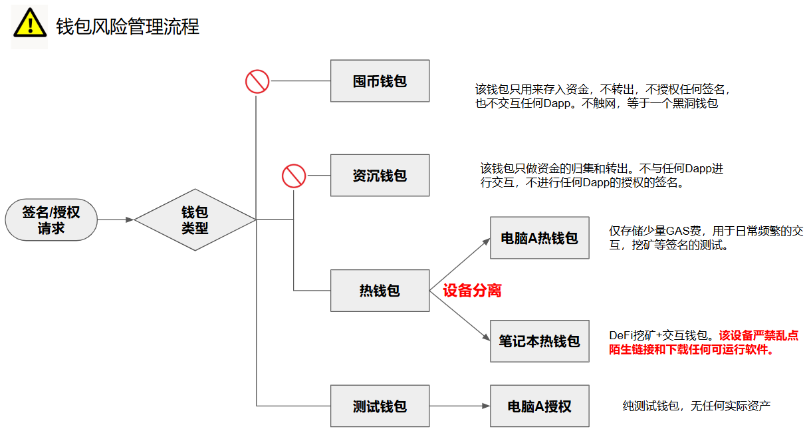

# 加密钱包管理

请牢记：安全永无止境！

链上钱包被盗的事件越来越多，尤其是各种社交软件上充斥着大量的诈骗信息，很不幸，我也曾中招了不止一次。交了学费，就该学会一些防盗的经验。除了要学会分辨哪些是骗局外，自己还应该做好风险的隔离。人总是会犯错，如果有一套系统的风险措施，就能大概率会隔离掉大部分的骗局。即使被骗，也可以确保自己的损失是最小的。

那么首先要做的就是资金的隔离。也就是我们常常听到的那句话：

不要把鸡蛋放在一个篮子里

所以，不同用处的资金应该使用不同的钱包。当然，这里也要做好钱包的备份，毕竟因为忘记助记词而丢失资金的例子数不胜数。在学习了HD钱包的相关知识后，有一点需要补充下，那就是不用每一类的钱包都备份一套助记词，可以在一套助记词下生成多个账户的钱包，不同的钱包对应不同应用场景。

钱包风险管理流程

## 钱包分类：

我目前有4类钱包：囤币钱包，沉淀资金钱包，挖矿交互钱包，测试钱包。

### 囤币钱包 - 冷钱包

要求高安全等级，我采用的是冷钱包的方式。用Onekey硬件钱包在不触网的前提下生成，或者通过不用的智能手机，在不触网的前提下安装钱包并生成助记词。使用钱包来完成以上工作就默认了你完全信任钱包的开放商，而更安全的做法是自己手搓一套助记词出来，这样可以确保真正的随机。

该钱包只用来存入资金，不转出，不授权任何签名，也不交互任何Dapp。可以说**这类钱包不触网**，对我来说就是一个黑洞钱包。

## 资产沉淀钱包

要求高安全等级，我采用的是硬件钱包的方式。由Onekey硬件钱包生成。

该钱包**只做资金的存入，归集以及转出。不与任何Dapp进行交互，不进行任何Dapp的授权的签名。**

## 挖矿/热钱包 - 3级管控

1. 500U以内：Mac热钱包
2. 500U-5,000U：Mac+Onekey硬件钱包
3. 5000U：Windows笔记本电脑+Onekey硬件钱包

### 500 USDC以内，使用Mac上的热钱包

由Matemask，OKX钱包，Binance Wallet等热门的钱包生成。该钱包主要用于DeFi挖矿，提供流动性，Lending，Staking，或者与Dapp授权签名和交互等。

### 500-5000 USDC，Mac + Onekey硬件钱包

资产超过100 USDC就应该使用硬件钱包，这样可以显著提高安全等级。另外，考虑到使用的方便性，所以放在Mac这个常用电脑上，兼具安全和便利性。

### 5000 USDC以上，Windows+Onekey硬件钱包

Windows笔记本电脑为不常用的电脑，常年离线且不开机，该笔记本电脑不会点陌生链接，任何链接都经过了Mac的验证，且它也不下载任何可运行的软件。所以它可用于大额资金交互/质押任务，只有涉及到大额资金才启用Windows笔记本电脑，并且要配合Onekey硬件钱包使用，可极大提高安全性。

**授权管理**——定期使用工具如Etherscan或Revoke.cash查看并清理DApp的授权权限。

---

## 测试钱包

要求低安全等级，该类钱包主要用于项目测试，建议存放少量GAS费即可。任何需要签名/授权都使用该钱包。

主要用Rabby Wallet来创建

最后，还是请牢记：

**安全永无止境，要持续学习最新的加密钱包安全实践，避免因信息滞后而中招！**

